<h1 align="center">
  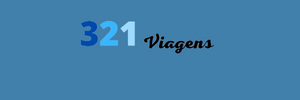
</h1>

  |&nbsp;<a href="#-tecnologias">Tecnologias</a>&nbsp;|&nbsp;
  <a href="#-projeto">Projeto</a>&nbsp;|&nbsp;
  <a href="#-layout">Layout</a>&nbsp;|&nbsp;

 

  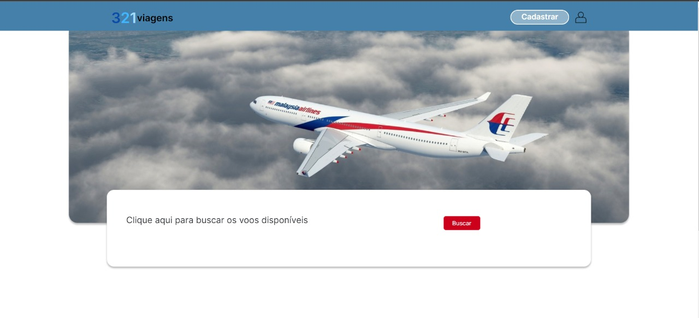
  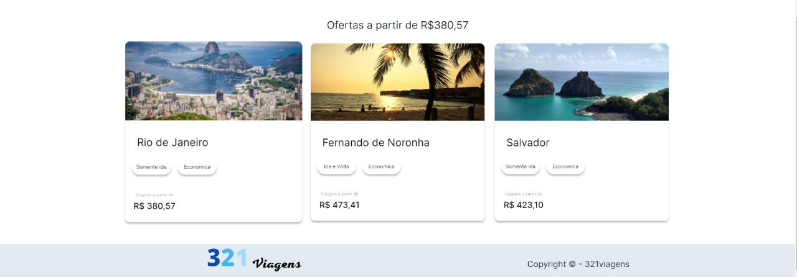

## 🚀 Tecnologias

Esse projeto foi desenvolvido com as seguintes tecnologias:

- HTML
- CSS
- Bootstrap
- JavaScript
- ReactJS
- PHP
- SQL

## 💻 Projeto

A 321viagens é uma aplicação que facilita a compra de passagens aéreas para todo o Brasil, onde é possível, criar uma conta e efetuar a compra da sua passagem de uma maneira facil e pratica.

A aplicação possui um usuário administrador, no qual, no painel de administração listará todos os usuários cadastrados, podendo editar, apagar e cadastar novos usuários dentro do aplicativo.

## 🔖 Layout

#### Tela inicial

  
  

#### Tela Cadastro

  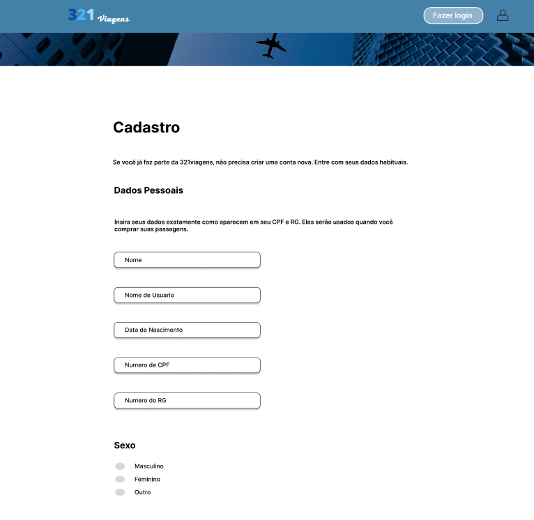
  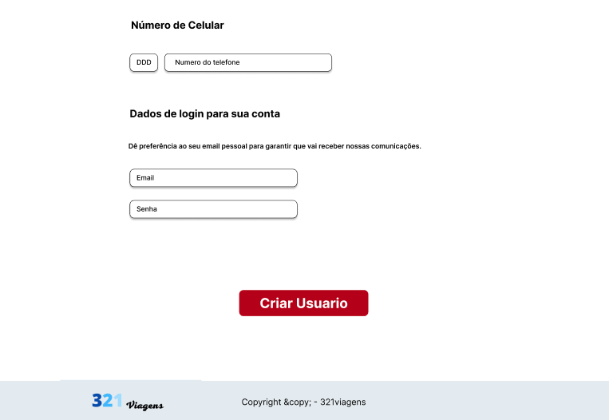

#### Tela de login

  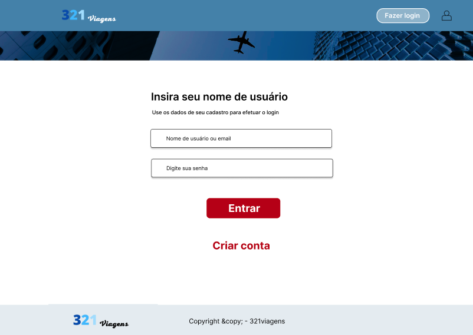

#### Tela do usuário

  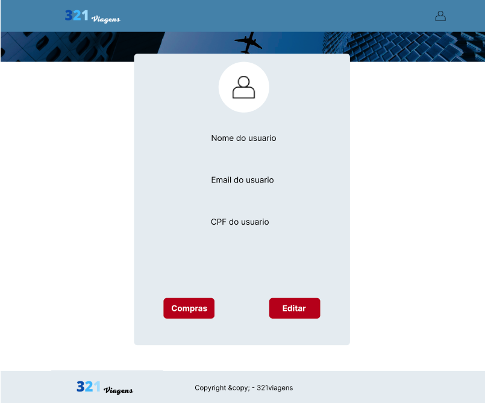

#### Tela de editar usuário

  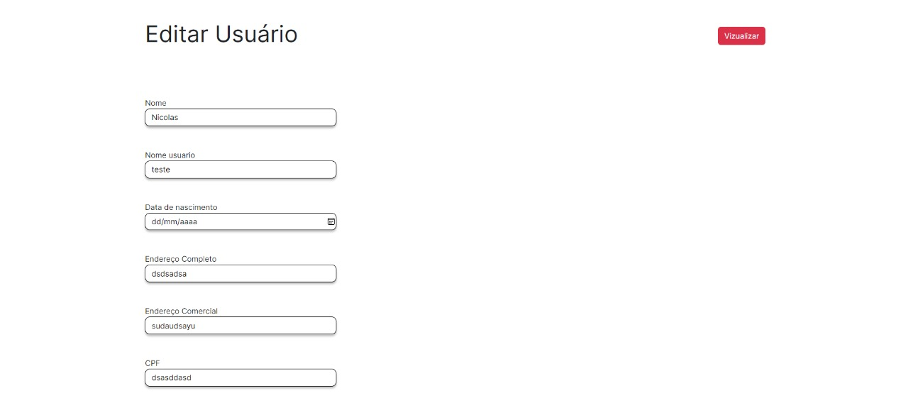
  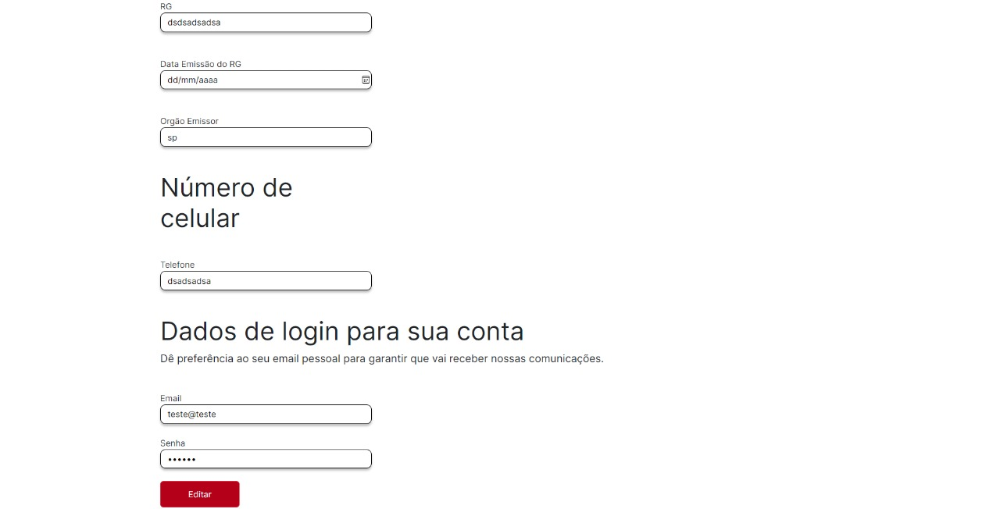

#### Tela do admin

  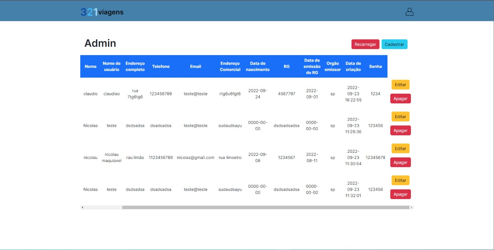

#### Tela de carrinho

  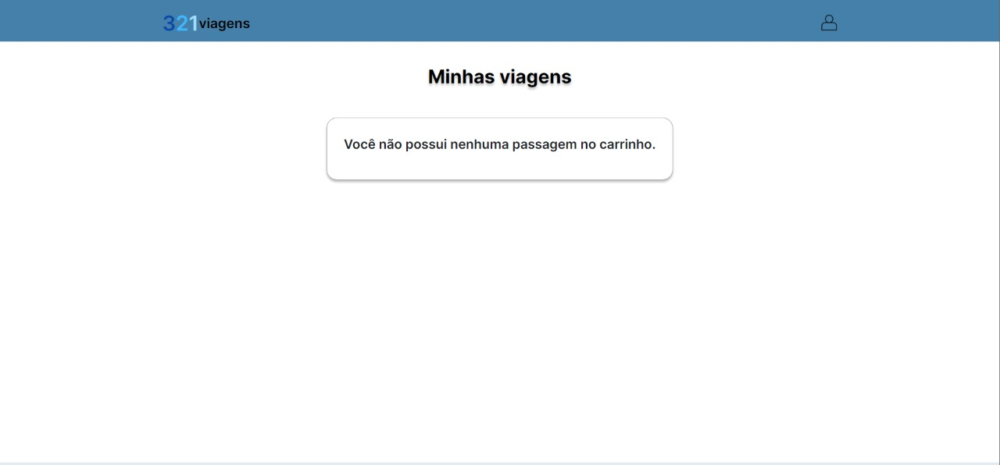

#### Tela de pagamento

  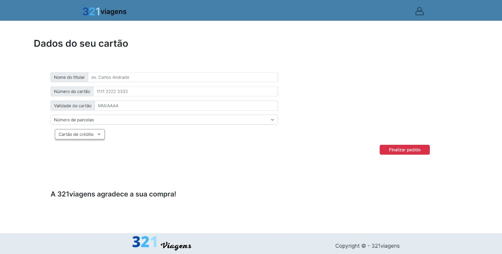

#### Tela de assentos

  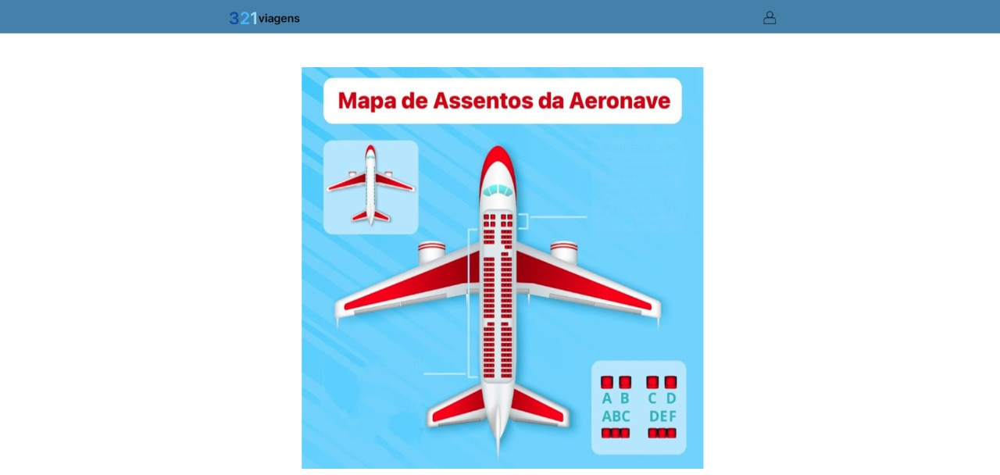
  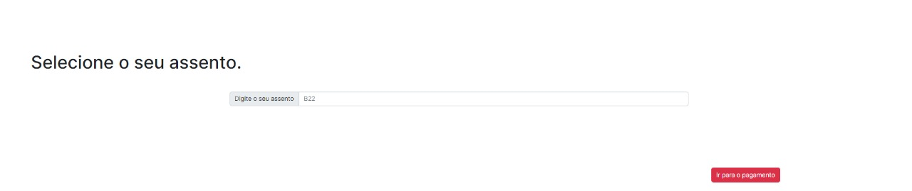

Você pode visualizar o layout do projeto através [desse link](https://www.figma.com/file/CZps7zB5MgH6Xiqo2DbPZi/Passagem_aerea?node-id=0%3A1). 

## :memo: Como rodar a aplicação

Após clonar o repositório, para instalar todas as dependências, utilize o comando:

### `npm install`

Depois de efetuar a instalação das dependências, para rodar o projeto digite:

### `npm start`

Abra [http://localhost:3000](http://localhost:3000) para vizualizar no navegador.

---

## Links
  - Repositório: https://github.com/NeckBlick/Passagem-aera

  ## Autores

  * **Nicolas Gomes** 
  * **Lucas Pereira**
  * **João Francisco**
  * **Miguel Soares**
  * **Vitor Perrone**

Feito com ♥ by 321viagens :wave:
